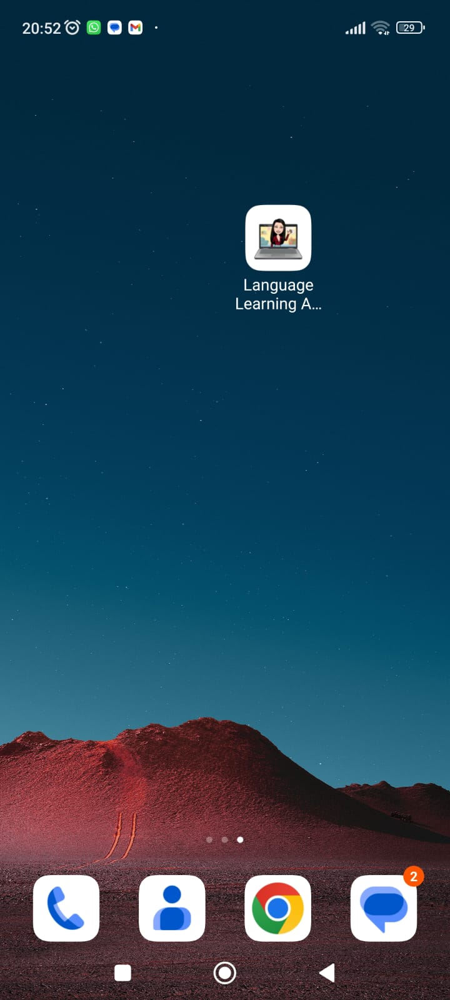
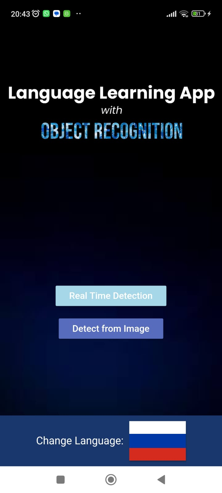
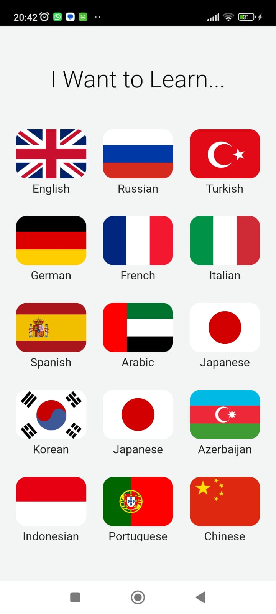
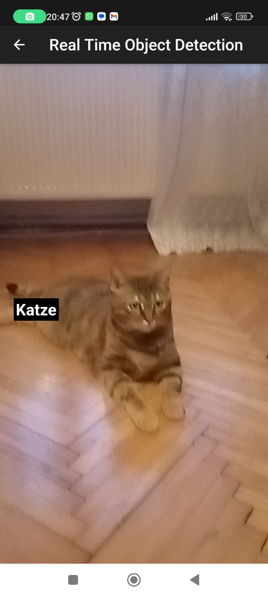
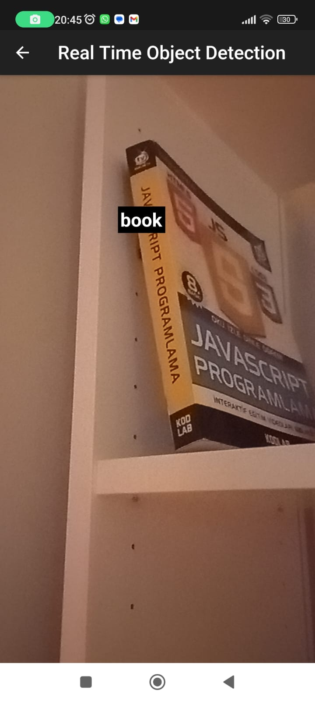
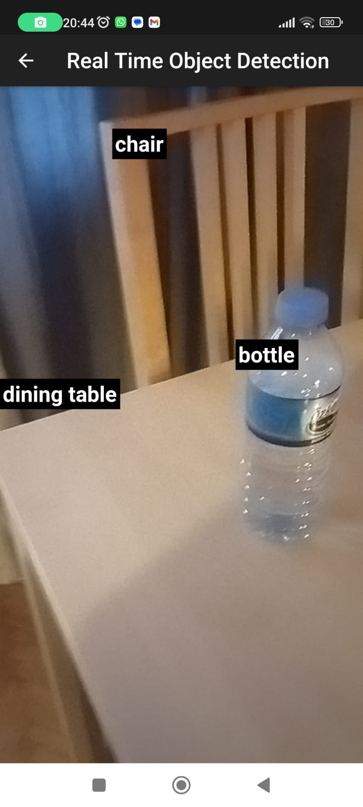
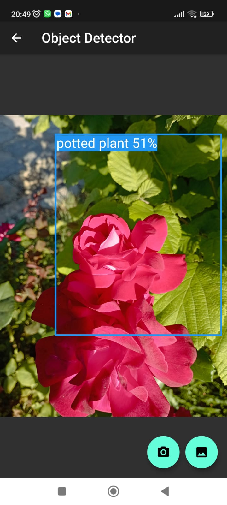

# Language Learning App with Object Recognition 📸🗣️

[](https://flutter.dev/)
[](https://www.tensorflow.org/lite)
[](LICENSE)

> A real-time language learning assistant that uses on-device computer vision to identify objects and teach you their names in 15 different languages.

---

## 📖 Overview

**Language Learning App with Object Recognition** is a cross-platform mobile application designed to bridge the gap between visual perception and vocabulary acquisition. By leveraging **TensorFlow Lite** and **Flutter**, the app transforms your phone's camera into an intelligent tutor. Point your camera at any object—a laptop, a chair, an apple—and instantly see its name in your target language, complete with audio pronunciation.

Unlike cloud-based solutions, this app runs its deep learning models **completely offline**, ensuring privacy and zero latency.

## ✨ Key Features

- **⚡ Real-Time Object Detection**: Powered by the **SSD MobileNet** model, identifying objects in milliseconds directly on your device.
- **🌍 Offline Multi-Language Support**: Learn vocabulary in **15 languages** (including Spanish, French, German, Japanese, and more) without needing an internet connection.
- **🖼️ Dual Recognition Modes**:
  - **Live Camera**: Instant detection and translation as you move.
  - **Static Image**: Pick photos from your gallery or snap a new one for analysis.
- **🔒 Privacy First**: All processing happens locally. No images are ever sent to a server.
- **🔊 Text-to-Speech**: Listen to the correct pronunciation of detected words (requires device TTS support).

## � Screenshots

### App Interface

|                 on Device                 |                  Home Screen                   |                Language Select                 |
| :---------------------------------------: | :--------------------------------------------: | :--------------------------------------------: |
|  |  |  |

### Real-Time Translation

|                  Cat 🐱                   |                  Book 📖                   |              Multiple Objects 🍎              |
| :---------------------------------------: | :----------------------------------------: | :-------------------------------------------: |
|  |  |  |

### Gallery Mode

|            Local Image Analysis             |
| :-----------------------------------------: |
|  |

## �🛠️ Tech Stack

| Component     | Technology                                                                                                        | Description                                                            |
| :------------ | :---------------------------------------------------------------------------------------------------------------- | :--------------------------------------------------------------------- |
| **Framework** |            | Cross-platform UI toolkit for iOS and Android.                         |
| **Language**  |                     | Optimized for fast apps on any platform.                               |
| **ML Engine** |  | Lightweight solution for mobile machine learning.                      |
| **Model**     | **SSD MobileNet**                                                                                                 | Single Shot MultiBox Detector for fast and efficient object detection. |

## 📂 Project Structure

A high-level overview of the core directories to help you navigate the codebase:

```plaintext
📦 Learn-Language-With-Object-Recognition
 ┣ 📂 assets
 ┃ ┣ 📂 images            # UI assets (flags, background, logo)
 ┃ ┗ 📂 models            # TFLite models and label files
 ┃ ┃ ┣ 📂 languages       # Localized label files (e.g., labels-spanish.txt)
 ┃ ┃ ┗ 📜 ssd_mobilenet.tflite
 ┣ 📂 lib
 ┃ ┣ 📂 realtime          # Real-time detection logic
 ┃ ┃ ┣ 📜 bounding_box.dart # Draws boxes around detected objects
 ┃ ┃ ┣ 📜 camera.dart       # Camera controller and stream handling
 ┃ ┃ ┗ 📜 live_camera.dart  # Main live detection screen & model loading
 ┃ ┣ 📂 static image      # Static image analysis logic
 ┃ ┃ ┗ � static.dart       # Gallery/Camera picker & detection logic
 ┃ ┗ 📜 main.dart         # Entry point, theme, and language selection
 ┗ 📜 pubspec.yaml        # Dependencies and asset configuration
```

## 🚀 Getting Started

### Prerequisites

- [Flutter SDK](https://flutter.dev/docs/get-started/install) installed.
- An IDE (VS Code or Android Studio) with Flutter/Dart plugins.
- **Android Device/Emulator**: API level 21+.
- **iOS Device/Simulator**: iOS 11.0+.

### Installation

1.  **Clone the repository**

    ```bash
    git clone https://github.com/rana00selim/Learn-Language-With-Object-Recognition.git
    cd Learn-Language-With-Object-Recognition
    ```

2.  **Install dependencies**

    ```bash
    flutter pub get
    ```

3.  **Run the app**
    Connect your device and run:
    ```bash
    flutter run
    ```

> [!TIP]
> Physical devices are recommended for testing the camera and object detection performance, as emulators may be slow or lack camera hardware support.

## 💡 Usage Examples

### Loading the Model

The app dynamically loads label files based on the user's selected language. Here's how the model loading is handled in `live_camera.dart`:

```dart
// Dynamic model loading based on language selection
loadTfModel() async {
  await Tflite.loadModel(
    model: "assets/models/ssd_mobilenet.tflite",
    // Loads the specific vocabulary file, e.g., labels-french.txt
    labels: "assets/models/languages/labels-" + widget.language + ".txt",
  );
}
```

### Handling Detection Results

Detection results are processed to render bounding boxes scaled to the screen size:

```dart
// processing detection results
setRecognitions(recognitions, imageHeight, imageWidth) {
  setState(() {
    _recognitions = recognitions;
    _imageHeight = imageHeight;
    _imageWidth = imageWidth;
  });
}
```

## 🤝 Contributing

Contributions are welcome! If you'd like to improve the UI, add more languages, or optimize the model:

1.  Fork the repository.
2.  Create a feature branch (`git checkout -b feature/AmazingFeature`).
3.  Commit your changes (`git commit -m 'Add some AmazingFeature'`).
4.  Push to the branch (`git push origin feature/AmazingFeature`).
5.  Open a Pull Request.

## 📄 License

This project was developed as a senior thesis project at FMV Işık University, 2023.

## 👥 Credits

- **Developer:** Rana Selim
- **Supervisor:** Asst. Prof. Rahim Dehkharghani
